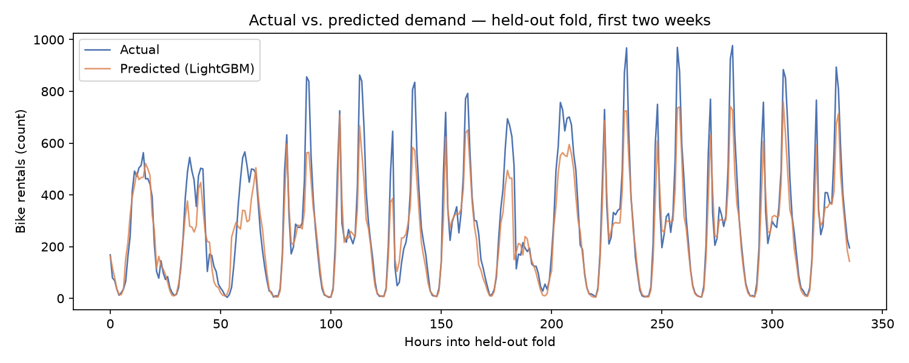
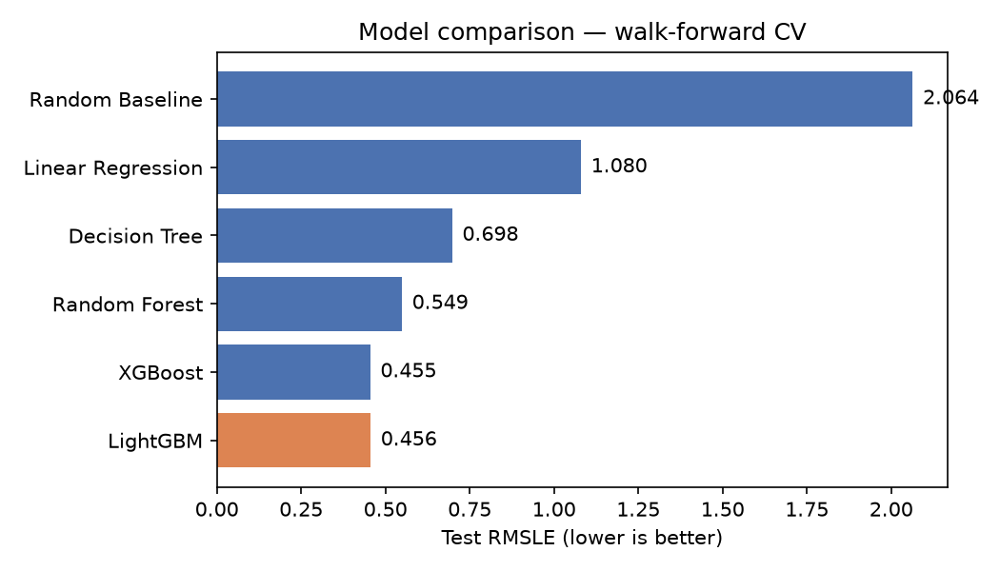

# Bike Sharing Demand

## **Check the final app live [here](https://bikesharingdemand-ieyv3duzrkv9sbptgttda9.streamlit.app/)**

Predicting hourly bike-rental demand from weather and calendar data, built as an
end-to-end project: EDA → model experimentation → a tracked, reproducible
training/inference pipeline (LightGBM + MLflow).

Based on the Kaggle ["Bike Sharing Demand"](https://www.kaggle.com/c/bike-sharing-demand)
competition.



## Results at a glance

Six models were compared with walk-forward (time-based) cross-validation; **LightGBM**
was selected as the best trade-off between accuracy, error magnitude, and bias:



| Model | Test RMSLE | Test MAE | Test R² |
|---|---|---|---|
| Random Baseline | 2.064 | 182.31 | -0.792 |
| Linear Regression | 1.080 | 126.58 | -0.030 |
| Decision Tree | 0.698 | 94.76 | 0.333 |
| Random Forest | 0.549 | 71.23 | 0.600 |
| **LightGBM (chosen)** | **0.456** | **60.34** | **0.712** |
| XGBoost | 0.455 | 61.19 | 0.700 |

LightGBM and XGBoost are essentially tied on RMSLE; LightGBM wins on MAE, R², and
prediction bias, so it's the model that ships.

## What this project demonstrates

- **Rigorous EDA**: found and fixed a data-completeness bug (fabricated calendar days
  from a naive `date_range` reindex), and caught a subtle **feature leakage risk**
  (`day_of_month` has disjoint train/test ranges and can't generalize) before it reached
  the model.
- **Correct validation for time series**: walk-forward `TimeSeriesSplit` instead of random
  K-Fold, because adjacent hours are autocorrelated and random shuffling would leak future
  information into training folds.
- **Metric-aligned modeling**: trained on `log1p(count)` to align the training loss with
  the competition's RMSLE metric, and diagnosed the resulting retransformation bias
  (Jensen's inequality) via an explicit bias-check step.
- **Systematic model comparison**: baseline → linear → tree → boosted trees, all evaluated
  on identical folds and metrics, instead of picking a model by default.
- **Production-minded MLOps**: training and inference share one feature-engineering module
  and one `sklearn.Pipeline` (preprocessing + model), tracked and versioned with MLflow, so
  training and serving can never silently drift apart.

## Data

| File | Role | Rows | Columns |
|---|---|---|---|
| `data/train.csv` | Model input (training) | 10,886 | `datetime`, `season`, `holiday`, `workingday`, `weather`, `temp`, `atemp`, `humidity`, `windspeed`, `casual`, `registered`, `count` |
| `data/test.csv` | Model input (inference) | 6,493 | Same as `train.csv` minus `casual`, `registered`, `count` |
| `data/submissions.csv` | Model output | 6,493 | `datetime`, `count` (predicted) |

- `casual` and `registered` (the two components of `count`) only exist in `train.csv` and
  are dropped before modeling — they aren't available at prediction time.
- Both files have a handful of genuinely missing hourly timestamps. Training gaps are
  forward-filled; test-set gaps are left alone, since those are hours Kaggle deliberately
  excludes from scoring, and `submissions.csv` must line up 1:1 with the rows actually
  present in `test.csv`.

## Project structure

```
notebooks/
  EDA.ipynb                    Data quality, missing hours, distributions, correlation
                                and multicollinearity analysis.
  Models Experiments.ipynb     Baseline + 5 models compared via walk-forward CV.

src/
  features.py                  Shared feature engineering (training + inference).
  train.py                     Trains the LightGBM pipeline, cross-validates, logs to MLflow.
  predict.py                   Loads a trained model from MLflow, scores test.csv.
  pipeline.py                  Runs train -> predict end to end.
  app.py                       Streamlit page listing the predictions in submissions.csv.

scripts/
  generate_readme_assets.py    Regenerates the charts above.

data/                          Kaggle-provided input + generated submissions.
mlruns/                        Local MLflow tracking store (git-ignored).
```

## Quickstart

```bash
./.venv/Scripts/activate                  # start virtual environment
python -m pip install -r requirements.txt # install requirements
python -m src.pipeline                    # train, log to MLflow, score test.csv
python -m mlflow ui --port 5551           # inspect experiment runs/metrics
streamlit run src/app.py                  # view the predictions in a browser table
```

Full CLI flags, architecture notes, and the reasoning behind each modeling decision are in
[CLAUDE.md](CLAUDE.md).

## Predictions viewer

`src/app.py` is a single-page Streamlit app that reads `data/submissions.csv` and displays
it as one table, with human-readable column names (`Date & Time`, `Predicted Bike
Rentals`). Run `python -m src.pipeline` (or `python -m src.predict`) at least once to
generate `submissions.csv` before launching it.

## Known limitations / future work

- **Casual vs. registered decomposition**: `count = casual + registered`, and these two
  rider types behave differently (registered commuters peak at rush hour, casual riders
  peak on weekends). Modeling them separately and summing predictions is the largest
  untried lever for improving on the current RMSLE.
- `data/submissions.csv` reflects whichever model was last run through the pipeline —
  regenerate it before treating it as a real Kaggle submission.
